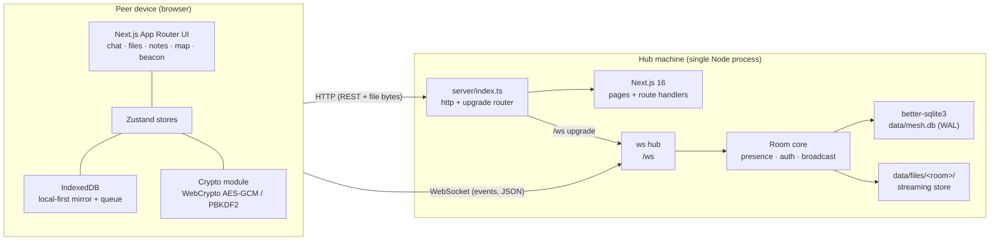
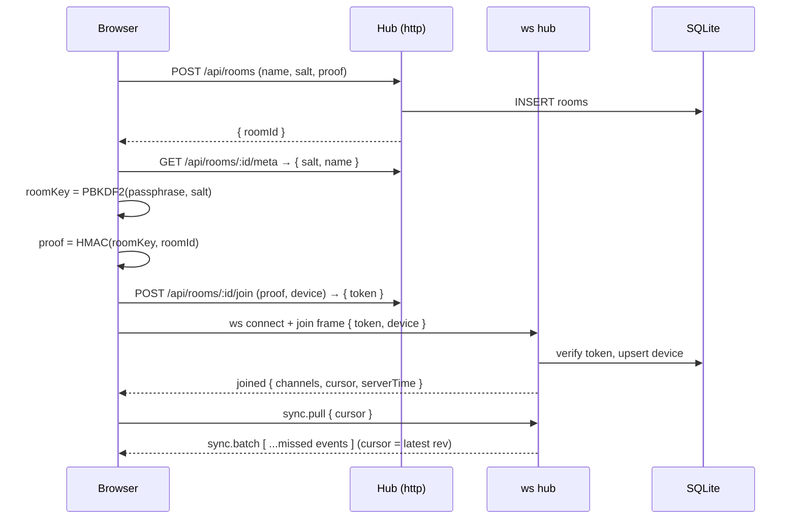
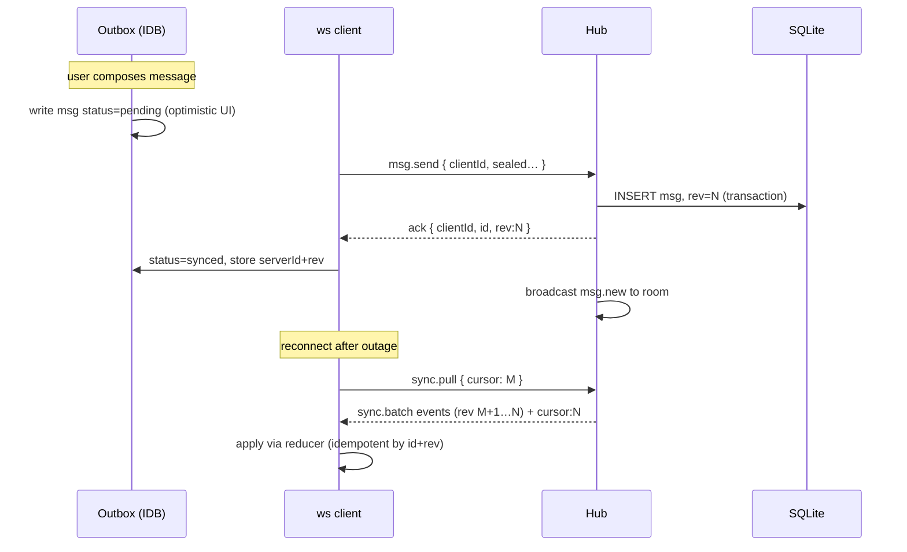

# SDA — OffGrid Mesh

> System Design & Architecture · v1 (alpha)
> Companion docs: [PRD](./PRD.md) · [TRD](./TRD.md) · [Implementation Plan](./IMPLEMENTATION-PLAN.md)

## 1. Architecture overview

One Node process serves both the Next.js application and the realtime hub. Peers are plain browsers on the same LAN. There is no cloud component, no container runtime, and no external service of any kind at runtime.



**Two planes, deliberately split:**

| Plane | Transport | Carries |
|---|---|---|
| **Control/event plane** | WebSocket at `/ws` (JSON frames, zod-validated) | chat, presence, typing, notes, checklist progress, waypoints, SOS, beacons, sync pulls, acks |
| **Data plane** | HTTP route handlers | room create/join, file upload (streaming), file download (Range-aware), health, static assets |

Rationale: WebSocket gives single-round-trip messaging and cheap broadcast; moving file bytes over HTTP avoids implementing backpressure/reassembly on binary frames while still being instant on LAN, and gains free `Range` resume for downloads.

## 2. Process model

`server/index.ts` owns a `node:http` server:

1. `upgrade` event → if `pathname === '/ws'`, hand to `ws` (`noServer: true` + `handleUpgrade`); **every other upgrade path is forwarded to `app.getUpgradeHandler()`** so Next's dev HMR keeps working.
2. `request` event → route `/api/**` to our handlers (or let Next route handlers handle them — see TRD §4; files use dedicated streaming handlers), everything else to `app.getRequestHandler()`.

Runs identically as `next dev` (via `tsx watch server/index.ts`) and production (`node --enable-source-maps dist/server/index.ts` after `next build` + `tsc -p server`).



## 3. Layering & module responsibilities

```
┌────────────────────────────────────────────────────────┐
│ Presentation   src/app/**  (routes)                    │
│                src/components/** (ui, layout, feature) │
├────────────────────────────────────────────────────────┤
│ Client domain  src/stores/**    (zustand: session,     │
│                                 mesh, chat, files,     │
│                                 survival)              │
│                src/lib/sync/**  (queue, cursor,        │
│                                 reducer, outbox)       │
│                src/lib/crypto/** (roomKey, seal/open)  │
│                src/lib/idb/**   (schema, repositories) │
├────────────────────────────────────────────────────────┤
│ Protocol       src/lib/protocol/**  zod schemas +      │
│               frame types shared client/server        │
├────────────────────────────────────────────────────────┤
│ Server core    server/core/**   rooms, auth, presence, │
│               broadcast, sync, rate limits             │
│               server/db/**     schema, migrations,     │
│                                 repositories           │
│               server/http/**   REST handlers, streaming│
│               server/ws/**     connection mgmt         │
├────────────────────────────────────────────────────────┤
│ Runtime        server/index.ts  (http + upgrade)       │
│                SQLite (WAL) · data/files/ · logs       │
└────────────────────────────────────────────────────────┘
```

Rules:
- `src/lib/protocol` is the **only** module allowed to define wire shapes; both sides import it.
- Client domain modules never touch the DOM; components never talk to the socket directly (they dispatch through stores).
- Server core never imports React/Next server-only APIs beyond `next`'s HTTP types; it is plain Node, unit-testable without booting Next.

## 4. Directory structure (target)

```
offgrid-mesh/
├── server/
│   ├── index.ts              # http server, upgrade router, bootstrap
│   ├── config.ts             # ports, limits, paths (env-overridable)
│   ├── ws/
│   │   ├── attach.ts         # ws server, connection lifecycle, heartbeat
│   │   ├── frames.ts         # inbound dispatch (zod → handlers)
│   │   └── broadcast.ts      # room fan-out
│   ├── core/
│   │   ├── rooms.ts          # create/join/proof verification
│   │   ├── presence.ts       # peer table, RTT, battery, last-seen
│   │   ├── messages.ts       # message pipeline + rev assignment
│   │   ├── notes.ts  checklist.ts  waypoints.ts  sos.ts  beacons.ts
│   │   └── sync.ts           # cursor-based batch pull
│   ├── db/
│   │   ├── index.ts          # connection, WAL, pragmas
│   │   ├── schema.ts         # DDL + idempotent migrations
│   │   └── repo/*.ts         # typed repository functions
│   └── http/
│       ├── rooms.ts          # create/meta/join/token
│       ├── files.ts          # streaming upload/download/Range/delete
│       └── health.ts
├── src/
│   ├── app/
│   │   ├── page.tsx          # landing (DESIGN.md editorial)
│   │   ├── layout.tsx        # fonts, providers, global chrome
│   │   ├── join/             # create/join room, passphrase, profile
│   │   ├── (app)/chat|files|notes|checklist|map|beacon|status|settings/
│   │   └── api/**            # thin re-exports to server/http where used
│   ├── components/
│   │   ├── ui/               # Button, Pill, ColorBlock, Eyebrow, Input…
│   │   ├── layout/           # TopNav, AppRail, StatusPill, SosButton
│   │   └── chat|files|notes|checklist|map|beacon|status/**
│   ├── lib/
│   │   ├── protocol/         # zod schemas, frame types, constants
│   │   ├── crypto/           # room key, seal/open, proofs
│   │   ├── sync/             # outbox, cursor, apply-event reducer
│   │   ├── idb/              # IndexedDB schema + repositories
│   │   ├── ws/               # socket client: reconnect, send/ack
│   │   └── utils/            # morse, geo, bytes, time, cn
│   ├── stores/               # zustand slices
│   └── content/              # checklists + guides JSON (offline)
├── public/                   # manifest, sw.js, icons
├── data/                     # gitignored: mesh.db, files/, logs/
├── docs/                     # PRD · SDA · TRD · IMPLEMENTATION-PLAN
└── DESIGN.md                 # upstream design guide
```

## 5. Data model & sync

### 5.1 Source-of-truth split

| Data | Authoritative | Mirror |
|---|---|---|
| Messages, notes, waypoints, checklist progress, SOS, files-meta | Hub (SQLite) | IndexedDB per peer |
| Own unsent messages (outbox) | Peer (IndexedDB) | pushed to hub on reconnect |
| Profile (name/color), preferences | Peer | — |
| File bytes | Hub (`data/files/`) | IndexedDB cache for files < 32 MB |
| Room key | Peer memory / sessionStorage | never persisted to disk |

### 5.2 Revision (rev) log

Every broadcastable mutation takes a row from a global monotonic sequence (`rev_seq`). Each event carries its `rev`. Clients persist `cursor = max(rev)`.



**Conflict policy:** messages are append-only (no conflicts). Notes, waypoints, checklist progress, and SOS use **per-item last-writer-wins** keyed on `(updatedAt, deviceId)` — deterministic across peers, no CRDT complexity. Documented limitation: two users editing one note in the same second keep the higher deviceId's version.

**Idempotency:** every inbound frame carries a client-generated `clientId` (ULID); the hub rejects duplicates and acks with the canonical record, so retries after reconnect are safe.

## 6. Identity, auth & cryptography

### 6.1 Model

- **No accounts.** Identity = `deviceId` (generated once per browser, stored in IndexedDB) + display name + color.
- **Room** = passphrase-protected space. Server stores `salt` and `proof` only.

### 6.2 Key schedule (WebCrypto)

```
roomSalt      = random 16 B                          (generated at room creation)
roomKey       = PBKDF2-SHA256(passphrase, roomSalt, 210_000, 256-bit)
proof         = HMAC-SHA256(roomKey, "offgrid-room-proof:" ‖ roomId)
token         = random 32 B issued on successful join (server stores SHA-256 hash)
seal(plain)   = AES-GCM-256(roomKey, iv=96-bit random) → { ct(b64), iv(b64) }
```

- **Create:** client generates `roomId` (ULID) + salt, derives key, computes proof, POSTs `{roomId, name, salt, proof}`.
- **Join:** `GET meta → salt`, derive key from entered passphrase, recompute proof, POST join → server compares against stored proof → issues bearer token. A wrong passphrase simply fails proof comparison; the server never sees the passphrase or key.
- **Unlock persistence:** `roomKey` lives in memory; `sessionStorage` caches it for the tab session so reloads don't re-prompt. A fresh browser session prompts again.

### 6.3 What is encrypted

| Encrypted at rest (AES-GCM) | Plaintext on hub (necessary metadata) |
|---|---|
| Message bodies, reply context | channelId, author name, deviceId, timestamps, sizes |
| Note titles + bodies | updated_at, updated_by |
| Waypoint labels | coordinates, color |
| SOS note | coordinates, active flag, timestamps |
| Shared morse text | wpm, timestamps |
| File **name** | mime, size, sha256, timestamps |

### 6.4 Threat model (honest)

- **Protects:** casual inspection / theft of the hub disk; a curious operator reading message content *at rest*; shared-hub usage where the hub owner is not the message author.
- **Does not protect:** a hostile hub operator in real time (the hub process relays ciphertext but a modified server could exfiltrate what peers *send* — this is transport-level, not E2E); metadata (who talks to whom, when, file sizes); plaintext file bytes (v1); passphrase disclosure (anyone with the passphrase is a full member by design).
- PBKDF2 at 210k iterations raises offline passphrase-guessing cost for stolen DB rows. Unaudited — stated in PRD non-goals.

## 7. Transport contracts (summary — full spec in TRD §5)

Client → server frame envelope: `{ t, ref?, ...payload }` where `ref` is the `clientId` used for acks.

| Domain | Frames |
|---|---|
| session | `join`, `leave`, `ping` |
| chat | `msg.send`, `msg.del`, `typing` |
| sync | `sync.pull` |
| presence | `presence.update` (battery/rtt) |
| notes | `note.save`, `note.del` |
| checklist | `check.set` |
| waypoints | `wp.save`, `wp.del` |
| sos | `sos.raise`, `sos.clear` |
| beacon | `beacon.share` |
| files | `file.announce` (after HTTP upload), `file.del` |

Server → client: `joined`, `ack`, `error`, `pong`, `presence`, `sync.batch`, and `*.new` / `*.upsert` / `*.deleted` events for each domain.

## 8. Survival-suite design notes

- **SOS:** raise → hub assigns rev → broadcast `sos.raised` → every client mounts a fixed-fullscreen overlay (coral/navy strobe + WebAudio alarm pattern) until `sos.cleared`. SOS also writes to `#sos`. The overlay must be dismissible by keyboard for a11y (blinking content honours `prefers-reduced-motion` with a static high-contrast panel + sound only).
- **Map:** coordinate plane (lat/lng when geolocation available, else arbitrary grid). Optional user image is calibrated by clicking two reference points and entering their known coordinates → affine scale/offset. Waypoints sync as data; image stays local to each device (file may be shared through the Files feature).
- **Checklists/guides:** versioned JSON shipped in the bundle (works offline after first load); progress is per-room synced state keyed by stable `itemId`.
- **Morse:** encoder maps text → timing table; playback uses WebAudio oscillator (tone) and a `<canvas>`/CSS-driven full-screen flasher driven by the same clock; presets include `SOS`, `HELP`, `DISTRESS`.
- **Status board:** battery via `navigator.getBattery()` with manual fallback; RTT from ws ping/pong; last-seen from heartbeat (15 s interval, 45 s timeout).

## 9. Resilience

- **Socket client:** exponential backoff reconnect (0.5 s → 10 s cap), outbox flush on `joined`, periodic `ping` for RTT + NAT/LAN staleness detection.
- **Offline shell:** hand-written `public/sw.js` caches app shell + static assets (cache-first), network-first for navigation with cache fallback; IndexedDB remains the data source, so history, notes, and checklists stay readable with the hub down (writes queue).
- **Hub durability:** SQLite WAL + synchronous NORMAL; file writes to `.part` then atomic rename; server logs rotating to `data/logs/`.
- **Limits:** max body size 1 MB for frames, 512 MB default file cap (configurable), per-connection token bucket (60 msg/s) to keep a rogue client from starving the LAN.

## 10. Design-system integration

`DESIGN.md` tokens are implemented as Tailwind 4 CSS-first theme variables in `src/app/globals.css`:

- Colors: `--color-primary`, `--color-canvas`, `--color-block-lime` … → utilities (`bg-block-lime`, `text-ink`).
- Type: `--font-sans` (Inter Variable ≈ figmaSans), `--font-mono` (JetBrains Mono ≈ figmaMono); role sizes as text tokens (`text-display-xl`, `text-headline`, `text-eyebrow`…) carrying the documented size/weight/tracking/leading.
- Weights: discrete tokens `font-320 … font-700` to prevent off-scale weights.
- Radii: `rounded-pill` (all CTAs), `rounded-full` (icon buttons), `rounded-lg` (color blocks).

**System laws encoded as conventions:** pill-only CTAs · one color block per viewport · no mid-gray text (weight, not opacity) · no shadows on color blocks · mono only for eyebrows/captions · one magenta CTA per page (reserved for SOS activate on `/beacon`).

App-panel ↔ block mapping: checklist `lime`, notes `cream`, map `navy`, beacon `coral`, status `mint`, promo/sync notices `lilac`, chat/files/settings stay white canvas.

## 11. Key decisions (ADR-style)

| # | Decision | Alternatives | Why |
|---|---|---|---|
| D1 | Custom `http` + `ws` server in one process | SSE+POST (no custom server); Next experimental route-handler WS | Single round trip, binary-free simplicity kept by splitting files to HTTP; experimental Next WS is unstable |
| D2 | Files over HTTP streaming, events over WS | All-WS binary chunks | Free `Range` resume, trivial backpressure via Node streams |
| D3 | Local-first IndexedDB + hub SQLite | Server-only | Survives hub outages; offline queue is a product requirement |
| D4 | Global monotonic `rev` log for sync | Per-table updated_at | One cursor, total order, idempotent replay |
| D5 | Per-item LWW for shared docs | CRDT/OT | Right-sized for checklist/waypoint/note use; zero extra deps |
| D6 | Passphrase proof (HMAC) + AES-GCM bodies | Plaintext room; server-side encryption | Server never learns passphrase; honest at-rest protection |
| D7 | better-sqlite3 (sync API) | Prisma, node:sqlite | Zero ORM overhead, WAL, prebuilt binaries, ideal for one-process hub |
| D8 | User-calibrated map image + grid | MapLibre + remote tiles / MBTiles | No cloud tiles, no heavy dep, works with paper-map scans |
| D9 | pnpm, plain vitest, no Docker/CI | npm/yarn, Playwright matrix | Matches "practical, local, non-enterprise" constraint |
| D10 | Inter + JetBrains Mono via @fontsource | Google Fonts CDN | DESIGN.md-sanctioned substitutes; zero runtime network |

## 12. Quality attributes

- **Latency:** LAN broadcast p50 < 300 ms (server fan-out is an in-memory map + JSON serialize).
- **Capacity target:** 30 concurrent peers / room, 100 k message history paged at 50 — comfortable beyond realistic field teams.
- **A11y:** WCAG AA contrast (black/white chrome passes), 44 px targets, keyboard-operable everything, reduced-motion honored on strobe effects.
- **Observability:** structured line logs (`data/logs/hub.log`) with room/device/frame counts — local only, no telemetry.
